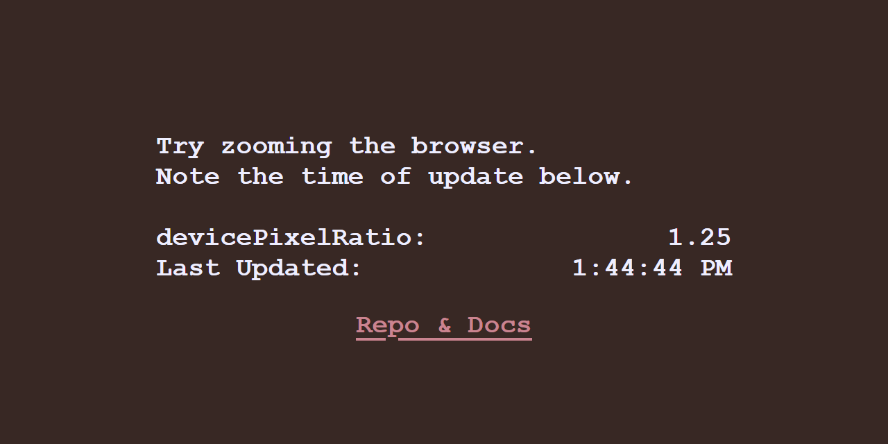

# browser-zoom-listener

*It's pointless...*

[**README**](https://github.com/coarchive/bzl-sro)

```shell
npm install --save browser-zoom-listener
```

[how-to-import](how-to-import.md)

### `browserZoomListener((devicePixelRatio: number) => void): void`

```ts
// like so:
browserZoomListener((dpr: number) => console.log(dpr));
```



[https://coalpha.github.io/browser-zoom-listener/example/](https://coalpha.github.io/browser-zoom-listener/example/)
